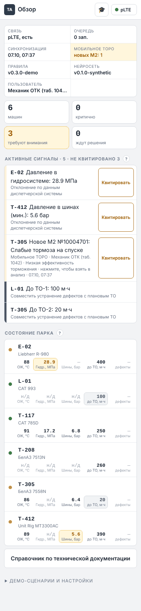
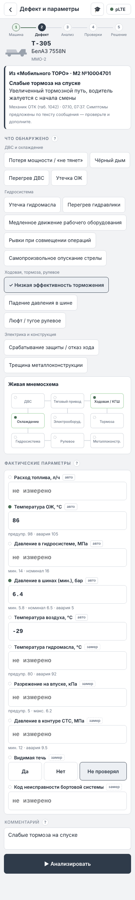
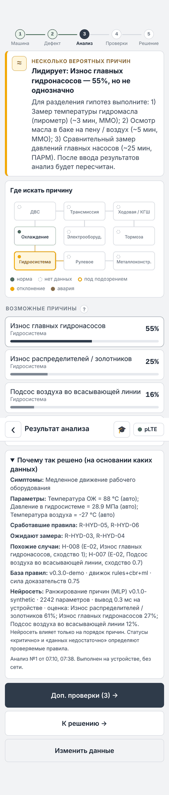
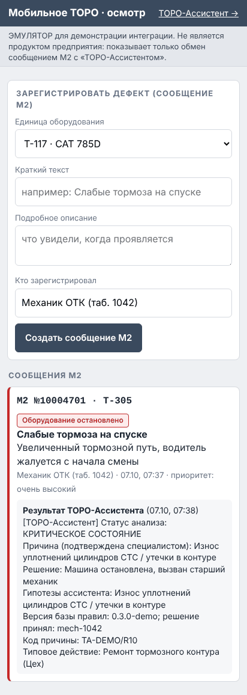

# ТОРО-Ассистент — MVP

Автономная интеллектуальная система поддержки решений при диагностике неисправностей самоходной горной техники.

> «Мобильное ТОРО» фиксирует, **что произошло**. «ТОРО-Ассистент» помогает определить, **что проверить и что делать дальше**.
> Агент не разрешает эксплуатацию потенциально опасной техники сам — решение принимает ответственный специалист.

## Быстрый старт

```bash
npm start            # узел карьера + приложение: http://localhost:8080
npm test             # unit-тесты: ядро, справочник, сервер
npm run demo         # 4+1 сценария в консоли (с нейросетью; --no-nn — без)
npm run train        # переобучить локальную нейросеть
python3 -m unittest discover -s tools    # шаблон экономики
node tests/e2e.mjs [папка]               # e2e + скриншоты (нужен playwright)
node tests/e2e-mtoro.mjs [папка]         # e2e интеграции с «Мобильным ТОРО»
```

Развёртывание на своём сервере или хостинге (Docker, systemd, панель с Node.js, статический хостинг, HTTPS) — `docs/deploy.md`.

Откройте страницу на телефоне в той же сети (или в DevTools в режиме смартфона). Приложение устанавливается как PWA. После первого открытия работает без связи.

## Что внутри

| Требование ТЗ | Где |
|---|---|
| 5 экранов Android-прототипа | `app/` — карточка машины, дефект и параметры, результат анализа, доп. проверки, решение и синхронизация |
| ≥ 4 демонстрационных сценария | `core/demo-data.js` — S1 однозначно, S2 несколько причин, S3 данных недостаточно, S4 критично, S5 бонус |
| Локальная нейросеть на устройстве | `core/nn.js`, `core/model/`, `docs/neural-network.md` |
| Интеграция с «Мобильным ТОРО» (+ эмулятор `/mtoro/`) | `core/mtoro.js`, `server/mtoro-adapter.js`, `docs/integration-mobile-toro.md` |
| Логика диагностического ядра | `core/engine.js`, `core/rules.js`, `docs/architecture.md` §3 |
| 5 функциональных модулей | `docs/architecture.md` §2 |
| Структура локальной БД | `app/db.js`, `docs/data-model.md` |
| Автономная работа, журнал, версионирование правил | `app/sw.js`, `app/sync.js`, `server/server.js` |
| ИБ-требования | `docs/architecture.md` §5 |
| Карта «есть / дополняем», AS-IS / TO-BE, потери, шаблоны, вопросы, ≥ 20 параметров | `docs/process.md` |
| Шаблон экономического расчёта | `tools/economics.py`, `templates/economics.template.json` |
| План внедрения ≤ 12 мес., распределение задач | `docs/team-tasks.md` |

**Интерфейс** — светлый, по принципам ISA-101 (High Performance HMI), смысловые цвета как на щите управления: зелёный — норма, жёлтый — требует внимания, красный — авария (мигает, пока сигнал не квитирован), серый — нейтрально.
- главная страница — всё для отслеживания: состояние системы (связь, очередь, версии правил и нейросети), сводка, активные сигналы по приоритету с квитированием, состояние парка с ключевыми параметрами;
- мнемосхема систем машины, стрелочные приборы с зонами порогов;
- пошаговый процесс 1→5, крупные элементы под перчатки;
- **режим обучения** (🎓): тур по каждому экрану с подсветкой элементов и встроенные подсказки «?».

## Структура

```
core/      диагностическое ядро (чистый JS, без зависимостей) + справочник + тесты
app/       PWA-клиент: UI, локальная БД, синхронизация, service worker
server/    узел карьера: sync API, раздача правил, журнал, выгрузка М2 + тесты
tools/     прогон сценариев, шаблон экономики
docs/      архитектура, модель данных, процессы, задачи команды
tests/     e2e
```

## Важно

- Все данные о машинах, история и **пороговые значения — синтетические, демонстрационные**. Перед пилотом их нужно заменить значениями из регламентов (см. `docs/team-tasks.md`, Дима).
- Материалы кейса **не публикуются** в этом репозитории: по условиям чемпионата их нельзя размещать в открытом доступе.
- При подготовке решения использовались инструменты ИИ. Это нужно раскрыть в презентации согласно Декларации CASE-IN.

## Скриншоты

| Главная: сводка, сигналы, новое М2 | Дефект из «Мобильного ТОРО» | Анализ + нейросеть | Эмулятор «Мобильного ТОРО»: результат в М2 |
|---|---|---|---|
|  |  |  |  |
