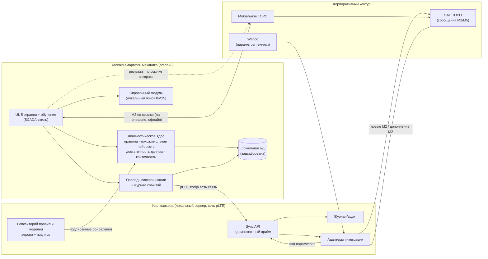

# Архитектура «ТОРО-Ассистента»

> **Формула проекта.** «Мобильное ТОРО» фиксирует, *что произошло*. «ТОРО-Ассистент» помогает понять, *что проверить и что делать дальше*.
> Это дополнительный контур к существующему процессу, а не замена «Мобильного ТОРО».

## 1. Общая схема

**Принцип offline-first.** Источник данных для интерфейса — всегда локальная БД. Сеть нужна только для обмена: отправить решения и получить обновления. Если связи нет, ничего не блокируется.

## 2. Пять функциональных модулей (п. 5.4 ТЗ)

| № | Модуль | В MVP | Где в коде | Промышленная версия |
|---|--------|-------|------------|---------------------|
| 1 | Экспертный модуль «если → то» | ✅ 28 правил, формат JSON, версии | `core/rules.js`, `core/engine.js → evalRule` | Правила пишет и валидирует надёжник, двойной контроль, подпись |
| 2 | Поиск похожих случаев | ✅ сходство по симптомам, модели и машине | `engine.js → findSimilarCases` | История из SAP ТОРО, взвешивание по давности и подтверждённости |
| 3 | Классификация и ранжирование причин (нейросеть) | ✅ локальная нейросеть MLP 43→32→16→18 на устройстве, < 1 мс; обучена на синтетике | `core/nn.js`, `tools/train-nn.js`, `core/model/` | ONNX Runtime Mobile, обучение на истории М2/М5 внутри контура — `docs/neural-network.md` |
| 4 | Оценка достаточности информации | ✅ статус «данных недостаточно» + перечень конкретных замеров | `engine.js → status, rankChecks` | Выбор проверок по ожидаемому приросту информации |
| 5 | Справочно-диалоговый модуль | 🟡 офлайн-поиск по документации + обоснование причин | `core/knowledge.js` | Полные регламенты; диалоговый слой на малой LLM (llama.cpp) — экспериментально |

## 3. Конвейер анализа

1. **Валидация.** Физически невозможные значения отбрасываются с предупреждением («требуется повторный замер»).
2. **Правила.** Каждое правило возвращает `FIRED`, `PENDING` (симптом есть, а нужного замера нет) или ничего. `PENDING` даёт малый вклад и порождает запрос замера.
3. **Похожие случаи.** Вклад в оценку = `0.3 × сходство`.
4. **Априорные данные.** Типовые неисправности модели (из перечня типовых отказов) дают небольшой бонус.
5. **Ранжирование.** Вероятности считаются через softmax по баллам.
6. **Статус:**
   - `CRITICAL` — сработало критическое правило (тормоза, рулевое, трещина, КГШ ниже критического давления, критическая температура ОЖ, самопроизвольное опускание стрелы);
   - `INSUFFICIENT` — сила подтверждённых правил ниже 0,6;
   - `CLEAR` — p₁ ≥ 0,6 и p₁ − p₂ ≥ 0,25;
   - иначе `MULTIPLE`.
7. **Проверки.** Отбираются недостающие замеры для `PENDING`-правил и проверки лидирующих причин. Порядок задаёт ценность / √время.
8. **Решения.** При `CRITICAL` действие «продолжить работу» недоступно. Допуск к работе даёт только роль `SENIOR_MECHANIC` и только с комментарием. **Агент никогда не разрешает эксплуатацию сам.**
9. **Трассировка.** В результат записываются симптомы, параметры с источником, сработавшие и ожидающие правила, похожие случаи, версия базы правил и тип движка. Всё это видно пользователю («Почему так решено»).

## 4. Синхронизация

- **Очередь `outbox`.** Каждая запись получает UUID и sha256 полезной нагрузки и шифруется на устройстве.
- **Пакетная отправка по 20 записей.** Сервер **идемпотентен**: повтор того же id даёт `duplicate`, второго сообщения в SAP не будет. При несовпадении хеша запись отклоняется.
- **Повторы.** Задержка растёт экспоненциально (30 с → 10 мин). Синхронизация запускается и по событию `online`.
- **Обновление правил.** Только с узла карьера, с проверкой целостности. Предыдущая версия сохраняется, откат делается одной кнопкой.
- **Интеграция с «Мобильным ТОРО».** Дефект приходит из сообщения М2 (ссылкой на телефоне или через узел карьера). Результат дописывается в то же М2; при сбое запись повторяется при следующей синхронизации. Подробно — `docs/integration-mobile-toro.md`.

## 5. Информационная безопасность (п. 9 ТЗ)

| Требование | MVP | Промышленная версия |
|---|---|---|
| Нет обязательного выхода в интернет | ✅ всё локально, сервер — в сети карьера | Сеть pLTE без маршрута в интернет |
| Локальное выполнение алгоритмов | ✅ ядро на устройстве | то же |
| Шифрование хранилища | ✅ AES-GCM-256, неизвлекаемый ключ (WebCrypto) | Room + SQLCipher, ключ в Android Keystore; СКЗИ по ГОСТ при требовании ИБ |
| Контроль доступа | 🟡 роли MECHANIC / SENIOR_MECHANIC, токен устройства | Вход по табельному/ПИН, сертификаты устройств из MDM |
| Журналирование | ✅ журнал на устройстве и на сервере | Централизованный аудит, неизменяемое хранилище |
| Версионирование правил и моделей | ✅ версия в каждом анализе, откат | Подпись ГОСТ Р 34.10-2012, двойной контроль выпуска |
| Обновление через корпоративный контур | ✅ только с узла карьера | MDM / корпоративный магазин приложений |
| Прозрачность рекомендаций | ✅ экран «Почему так решено» | то же + выгрузка для расследований |
| Запрет автономного допуска при критических событиях | ✅ на уровне ядра и интерфейса, покрыто тестами | то же |

## 6. Целевой технологический стек (промышленная версия)

**Предпочтение — отечественные компоненты.**

- **Клиент.** Kotlin + Jetpack Compose, Room + SQLCipher, WorkManager для фоновой синхронизации, ONNX Runtime Mobile для ML. Ядро переносится в общий Kotlin-модуль один к одному: это чистые функции без I/O. Возможная альтернатива — «Форсайт. Мобильная платформа», на которой построено «Мобильное ТОРО».
- **Узел карьера.** Сервер на Astra Linux, Postgres Pro / PostgreSQL, сервис синхронизации (текущий `server/` — референс API), контейнеризация.
- **Интеграция.** SAP ТОРО (сообщения М2/М5) через корпоративную интеграционную шину; Wenco — чтение параметров по API или выгрузкой.
- **Устройства.** Защищённые смартфоны на Android 9+ с поддержкой работы в перчатках.

## 7. Почему прототип сделан как PWA

PWA устанавливается на Android, работает офлайн (Service Worker + IndexedDB) и не требует Android SDK. Это быстрый путь к демонстрации на реальном телефоне. Ядро и API синхронизации спроектированы так, чтобы переход на нативный Kotlin не менял логику (задача Макса и Андрея, см. `team-tasks.md`).
