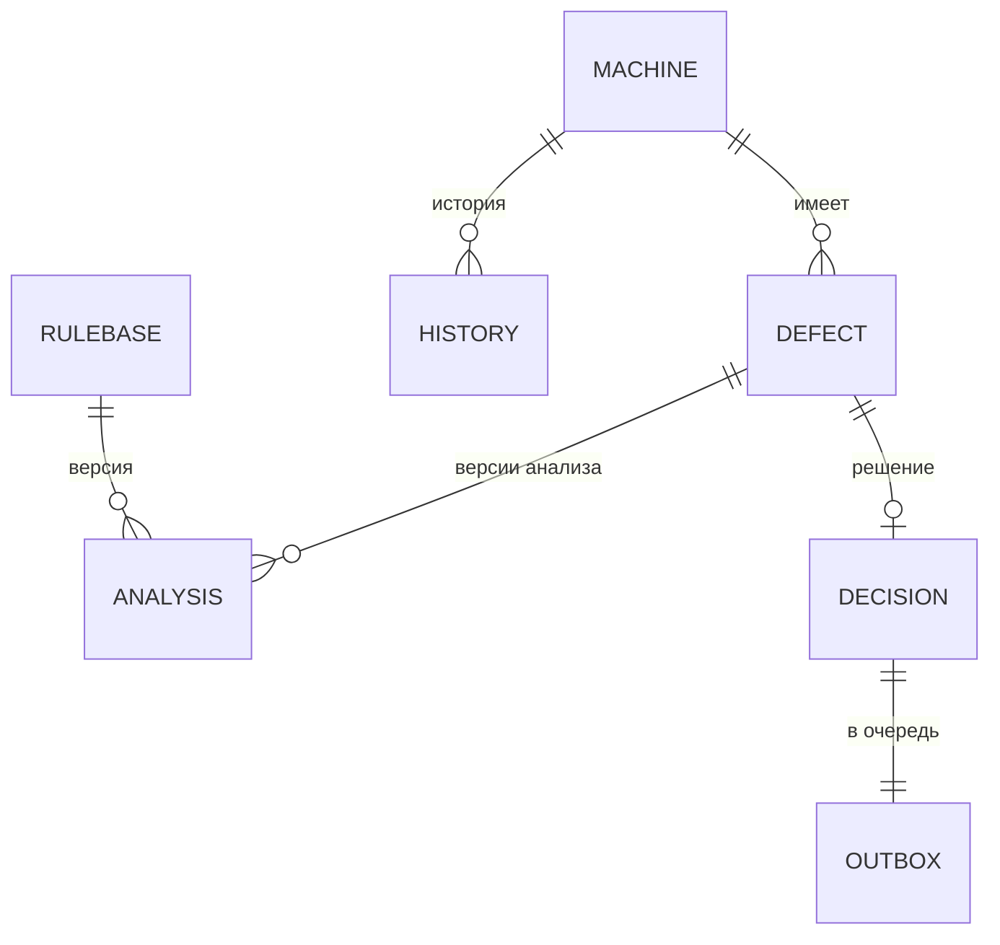

# Структура локальной базы данных

Сейчас БД реализована на IndexedDB (`app/db.js`). Промышленная версия — Room + SQLCipher; таблицы соответствуют хранилищам один к одному.

| Таблица | Ключ | Поля | Примечание |
|---|---|---|---|
| `machines` | `id` (бортовой №) | model, engineHours, mileage, nextServiceAt, serviceType, location | Справочник, обновляется при синхронизации |
| `history` | `id` | machineId, model, date, symptoms[], cause, downtimeH | Подтверждённые отказы для поиска похожих случаев |
| `defects` | `id` (UUID) | machineId, symptoms[], params{}, comment, createdAt, status OPEN/DECIDED, analyses[], decision{} | Карточка дефекта |
| `analyses` | `id` (UUID) | defectId, createdAt, params (снимок), symptoms, result (полный вывод ядра с трассировкой) | Неизменяемые, по одной на каждый пересчёт |
| `decisions` | `id` (= id в outbox) | defectId, sealed {iv, ct} | Шифруется AES-GCM |
| `outbox` | `id` (UUID) | type, createdAt, hash (sha256), sealed, attempts, lastError | Очередь синхронизации |
| `journal` | `seq` (автоинкремент) | ts, event, user, details | Журнал событий; на устройстве не редактируется |
| `meta` | `key` | deviceKey (CryptoKey), deviceId, user, rulebase, rulebasePrevious, lastSync, training, forceOffline | Настройки, ключ, текущая и предыдущая версии правил |

## Параметр в анализе

`{ key, label, value, unit, source: WENCO | MANUAL }` — источник фиксируется, чтобы было видно, на каких данных основана рекомендация.

## События журнала

`DEVICE_INITIALIZED`, `DEFECT_CREATED`, `ANALYSIS_DONE`, `CHECKS_ENTERED`, `DECISION_CONFIRMED`, `OUTBOX_ENQUEUED`, `SYNC_DONE`, `SYNC_SKIPPED_OFFLINE`, `RULES_UPDATED`, `RULES_REJECTED`, `RULES_ROLLED_BACK`, `USER_SWITCHED`, `TRAINING_ON/OFF`, `OFFLINE_SIMULATION_ON/OFF`.

## Сервер (узел карьера)

| Эндпоинт | Назначение |
|---|---|
| `GET /api/health` | Проверка связи (без авторизации) |
| `GET /api/rules` | База правил + sha256 + подпись |
| `GET /api/reference` | Справочник машин и история |
| `POST /api/sync` | `{deviceId, items[]}` → `{acks[]}`, идемпотентно |

Хранилище MVP — JSON-файл и JSONL-журналы в `server/data/`. Промышленная версия — PostgreSQL (задача Влада).
