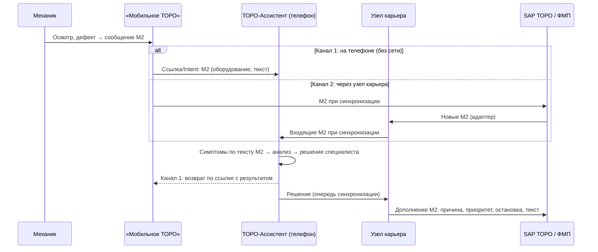

# Интеграция с «Мобильным ТОРО»

**Принцип.** Дефект регистрируется в «Мобильном ТОРО» (сообщение вида М2), как и сейчас. «ТОРО-Ассистент» берёт это сообщение, помогает с диагностикой и **дописывает результат в то же сообщение**. Двойного ввода нет, «Мобильное ТОРО» не дублируется.



## Два канала — зачем оба

| | Канал 1: на телефоне | Канал 2: через узел карьера |
|---|---|---|
| Как | «Мобильное ТОРО» открывает ассистент ссылкой (Android Intent / deep link) с данными М2 и адресом возврата | Узел карьера забирает новые М2 через адаптер. Они появляются в ассистенте как сигнал «Новое М2» |
| Связь нужна? | **Нет** — оба приложения на одном телефоне | Только для синхронизации |
| Что нужно от «Мобильного ТОРО» | Кнопка «Анализ в ТОРО-Ассистенте» в карточке сообщения (небольшая доработка на ФМП) | API или выгрузка сообщений через интеграционную шину, доработка не нужна |
| Возврат результата | Сразу, ссылкой возврата: виден в «Мобильном ТОРО» без сети | Дописывается в М2 на сервере после синхронизации |

## Что реализовано

| Компонент | Файл |
|---|---|
| Контракт обмена, разбор текста М2 в симптомы, формирование дополнения М2, ссылки туда и обратно | `core/mtoro.js` |
| Адаптер: режим `emulator` (по умолчанию) и `rest` (шлюз к реальной системе) | `server/mtoro-adapter.js` |
| Входящие М2 для ассистента `GET /api/inbox`, запись результата при синхронизации, повтор при сбое | `server/server.js` |
| Клиент: сигнал «Новое М2», «взять в анализ», приём по ссылке, панель источника, кнопка «Вернуться в Мобильное ТОРО» | `app/app.js`, `app/sync.js` |
| **Эмулятор «Мобильного ТОРО»** для демонстрации | `/mtoro/` (`mtoro/`) |
| Тесты | `core/mtoro.test.js`, `server/server.test.js`, `tests/e2e-mtoro.mjs` |

## Демонстрация (5 минут)

1. Откройте `http://<сервер>/mtoro/` — это эмулятор «Мобильного ТОРО».
2. Выберите T-305 и введите «Слабые тормоза на спуске» → «Создать сообщение М2».
3. **Канал 2.** Откройте ассистент `/`. Через несколько секунд или после «Синхронизировать» на главной появится сигнал «Новое М2 №…».
   1. Нажмите на сигнал: симптом «тормоза» уже отмечен.
   2. Введите давление СТС 10,8 → анализ покажет «Критическое».
   3. Выберите «Остановить машину».
   4. Вернитесь в эмулятор: сообщение помечено «Оборудование остановлено», приоритет «очень высокий», внутри — результат ассистента.
4. **Канал 1.** В эмуляторе создайте ещё одно М2 и нажмите «Анализ в ТОРО-Ассистенте».
   1. Ассистент откроется сразу на карточке дефекта.
   2. После решения нажмите «← Вернуться в «Мобильное ТОРО»» — эмулятор покажет полученный результат.

## Контракт (для согласования с владельцами «Мобильного ТОРО» / SAP)

### Сообщение М2 → ассистент

| Поле обмена | Поле SAP | Описание |
|---|---|---|
| `qmnum` | QMNUM | Номер сообщения |
| `qmart` | QMART | Вид сообщения, `M2` |
| `equnr` | EQUNR | Единица оборудования (в прототипе — бортовой номер) |
| `qmtxt` | QMTXT | Краткий текст |
| `longText` | длинный текст | Подробное описание |
| `author` | ERNAM | Кто зарегистрировал |
| `createdAt` | AUSVN / QMDAT | Начало неисправности / дата |

### Ассистент → дополнение М2

| Поле обмена | Поле SAP | Описание |
|---|---|---|
| `causeCode {group, code}` | URGRP / URCOD | Код причины. **В прототипе — демо-каталог `TA-DEMO`**, заменяется каталогом предприятия |
| `priority` 1…4 | PRIOK | 1 — критическое состояние, 2 — остановка / ремонт в цехе, 3 — прочее |
| `breakdown` | MSAUS | Признак остановки оборудования |
| `longText` | длинный текст (добавление) | Статус анализа, подтверждённая причина, решение, гипотезы, версия правил, кто принял решение |
| `action` | — / мероприятие | Типовое действие и место (ММО / ПАРМ / цех) |

### REST-шлюз (режим `MTORO_MODE=rest`)

| Метод | Путь | Назначение |
|---|---|---|
| `GET` | `{MTORO_URL}/messages` | Сообщения М2 (адаптер берёт те, где ещё нет результата ассистента) |
| `GET` | `{MTORO_URL}/messages/{qmnum}` | Одно сообщение |
| `POST` | `{MTORO_URL}/messages/{qmnum}/assistant` | Дописать результат ассистента |

Авторизация: `Authorization: Bearer {MTORO_TOKEN}`. Эмулятор реализует ровно этот контракт по адресу `/mtoro/api`. Поэтому переключение на реальную систему — это `MTORO_MODE=rest MTORO_URL=…` без изменений кода ассистента. Тест `REST-адаптер работает по тому же контракту` это проверяет.

### Ссылка «Мобильное ТОРО» → ассистент (канал 1)

```
/#/import?qmnum=10004701&eq=T-305&text=Слабые тормоза&long=…&author=…&at=2026-10-07T07:31:00Z&ret=/mtoro/
```

На Android: `Intent` с теми же полями или deep link `toro-assistant://import?...`. Возврат — по `ret` с параметрами `qmnum, status, decision, cause`. Разрешён **только относительный адрес** (защита от подмены ссылки, покрыто тестом).

## Что остаётся сделать для реальной интеграции

1. Получить у владельцев системы описание API или выгрузки М2 (ФМП / SAP / интеграционная шина) и реализовать `restAdapter` по факту — сейчас он соответствует нашему контракту.
2. Заменить демо-каталог причин (`CAUSE_CODES`) каталогом повреждений и причин предприятия.
3. Согласовать доработку «Мобильного ТОРО» для канала 1: кнопка в карточке сообщения и приём ответа.
4. Сопоставить `EQUNR` с бортовыми номерами (справочник оборудования).
5. Заменить разбор текста по ключевым словам каталожными кодами, если механик выбирает их в «Мобильном ТОРО».
