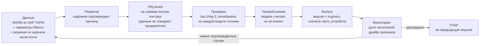

# Локальная нейросеть на Android

> Требование решения: интеллектуальный анализ выполняется **на смартфоне**, без интернета и без обращения к внешним сервисам.
> В «ТОРО-Ассистенте» это реализовано двумя уровнями:
> 1. **Нейросеть ранжирования причин** — обязательная, маленькая, быстрая. **Уже работает в MVP.**
> 2. **Локальная языковая модель** для диалога и объяснений — дополнительная, экспериментальная.

## 1. Место нейросети в решении

| Компонент | Роль | Почему именно так |
|---|---|---|
| Правила «если → то» | Безопасность и проверяемость: критичность, «данных недостаточно», запреты | Требования промбезопасности должны выполняться детерминированно и проверяться надёжником |
| Поиск похожих случаев | Опыт предприятия: «так уже было на этой машине» | Работает с первого дня, даже на небольшой истории |
| **Нейросеть** | Ранжирование причин по **совокупности** признаков, включая слабые и неочевидные сочетания | Улавливает закономерности, которые сложно записать правилами; качество растёт с накоплением данных |

> **Главный принцип.** Нейросеть влияет только на **порядок** гипотез. Решения, от которых зависит безопасность, — «критическое состояние», «данных недостаточно», запрет допуска — принимают только проверяемые правила. Это закреплено тестом: даже нейросеть, уверенная на 100 % в безобидной причине, не снимает статус CRITICAL (`core/nn.test.js`).

## 2. Что работает в MVP

| Характеристика | Значение |
|---|---|
| Архитектура | Многослойный перцептрон 43 → 32 → 16 → 18, ReLU, softmax |
| Параметров | 2 242 |
| Размер модели | ≈ 20 КБ |
| Время вывода | < 1 мс на устройстве (в браузере телефона), без сети |
| Вход | 43 признака дефекта (ниже) |
| Выход | Вероятности 18 групп неисправностей |
| Версия | `0.1.0-synthetic`, контрольная сумма sha256, проверка совместимости со справочниками |
| Где видно | Экран анализа → «Почему так решено» → строка «Нейросеть» (версия, время вывода, оценка); главная → «Нейросеть vX» |
| Код | `core/nn.js` (вывод), `tools/train-nn.js` (обучение), `core/model/nn-model.js` (веса) |

> ⚠️ **Модель MVP обучена на синтетических данных.** Это 8 100 случаев, сгенерированных из экспертных шаблонов «причина → признаки». Метрики на отложенной выборке — top-1 88,5 %, top-3 99,3 % — показывают, что **конвейер работает**, но **это не точность на реальной технике**. Реальная точность будет известна после обучения на истории предприятия. Заявлять её до этого нельзя (п. 11 ТЗ).

### Признаки на входе

| Группа | Признаки | Кодирование |
|---|---|---|
| Симптомы | 14 симптомов (потеря мощности, течь, медленная гидравлика…) | 1 / 0 |
| Параметры | 9 числовых (t ОЖ, t гидромасла, давления: гидросистема, шины, СТС; разрежение на впуске; изоляция; t инвертора; разбаланс насосов) | **Нормированное отклонение от порога этой модели** + маска «замерено / нет» |
| Наблюдения | Пена в масле, видимая течь | +1 / −1 / 0 (не проверяли) + маска |
| Код неисправности | Префикс INV, наличие кода | 1 / 0 |
| Техника | Класс (самосвал 136 т / 90 т / погрузчик / экскаватор), электропривод | one-hot |

**Почему отклонение, а не сырое значение.** У разных марок разные нормы. 6,0 бар — норма для одной шины и авария для другой. Нормировка по порогам регламента («насколько хуже нормы») даёт одной модели работать на разнородном парке.

**Почему маска «замерено / нет».** Нейросеть отличает «давление в норме» от «давление не измеряли». Это важно для режима «данных недостаточно».

### Как сочетается с остальным ядром

```
баллы причины = правила + 0.2 × ожидающие замера правила + 0.3 × сходство похожих случаев
              + бонус типовой неисправности + 0.6 × вероятность нейросети
вероятности   = softmax(баллы)
статус        = CRITICAL / INSUFFICIENT — только по правилам; CLEAR / MULTIPLE — по распределению вероятностей
```

## 3. Жизненный цикл модели (промышленная версия)



1. **Данные.** Ассистент сам накапливает размеченную выборку. Каждое решение специалиста сохраняется с признаками, гипотезами агента и полем `agreesWithAgent`: подтвердил специалист первую причину или нет. Плюс исторические сообщения М2/М5 с причинами из SAP ТОРО.
2. **Обучение — на узле карьера или в ЦОД предприятия.** Внешние облака не используются. Модель того же размера обучается за секунды или минуты, GPU не нужен.
3. **Выпуск.** Модель — это файл весов с версией и подписью. Он распространяется тем же каналом, что и база правил. Устройство проверяет подпись и совместимость (`compatible()`): несовместимая модель не подключается, ядро работает на правилах.
4. **Теневой режим.** Первые недели новая модель считает «в фоне», и её ответы сравниваются с решениями специалистов. В рекомендации она включается только после подтверждения качества.
5. **Откат.** Предыдущая версия хранится на устройстве, как и предыдущая версия правил.

## 4. Как это исполняется на Android

| | MVP (сейчас) | Промышленная версия |
|---|---|---|
| Среда | JavaScript в браузере/PWA на телефоне | Нативное приложение на Kotlin |
| Движок | Собственный вывод MLP (~30 строк) | **ONNX Runtime Mobile** (библиотека для Android, CPU / NNAPI / XNNPACK); альтернатива — LiteRT (TensorFlow Lite) |
| Формат модели | JS-модуль с весами | `.onnx` (экспорт из PyTorch / scikit-learn) |
| Хранение | Кэш приложения | Шифрованное хранилище приложения, подпись проверяется при загрузке |
| Ресурсы | < 1 мс, ~20 КБ | ~1–5 мс, < 1 МБ, без GPU, энергопотребление пренебрежимо мало (важно на морозе) |

Пример вывода на Kotlin (схема):

```kotlin
val env = OrtEnvironment.getEnvironment()
val session = env.createSession(modelBytes, OrtSession.SessionOptions().apply { addNnapi() })
val x = OnnxTensor.createTensor(env, arrayOf(featurize(machine, defect, params)))   // FloatArray(43)
val probs = (session.run(mapOf("input" to x))[0].value as Array<FloatArray>)[0]     // FloatArray(18)
```

Функция `featurize` переносится из `core/nn.js` один к одному. Golden-тесты гарантируют, что Kotlin- и JS-версии дают одинаковые признаки и одинаковый ответ.

## 5. Второй уровень: локальная языковая модель (экспериментально)

**Зачем.** Механик спрашивает своими словами («что значит пена в баке и что делать?»). Получает ответ простым языком **со ссылкой на регламент**. Может надиктовать описание дефекта голосом.

**Как.**
- Исполнение: llama.cpp на устройстве, квантизация 4 бита.
- Размер модели: 1–3 млрд параметров (≈ 1–2 ГБ).
- Требования к смартфону: ≥ 8 ГБ ОЗУ.
- Скорость: ориентировочно единицы–десятки слов в секунду, зависит от процессора — проверить на целевых устройствах.
- Модель отвечает **только на основе найденных фрагментов** локального справочника (`core/knowledge.js`, схема RAG).
- Голосовой ввод — офлайн-распознавание речи на устройстве.

**Жёсткие ограничения:**
- языковая модель **не участвует** в выборе причины и статуса;
- не выдаёт пороги и нормы «из головы» — только цитирует документ;
- если устройство не тянет модель, функция отключается, остальное работает как прежде;
- выбор конкретной модели — с учётом требований ИБ, лицензии и предпочтения отечественных разработок; оценить открытые русскоязычные модели подходящего размера.

## 6. Почему не «одна большая нейросеть на всё»

1. **Промышленная безопасность.** Запрет допуска при отказе тормозов должен срабатывать всегда и проверяемо, а не «с вероятностью 97 %».
2. **Объяснимость.** Механик и надёжник видят, на каких правилах, замерах и случаях основан вывод. Нейросеть — один из голосов, её вклад виден отдельно.
3. **Мало размеченных данных на старте.** Правила и похожие случаи работают с первого дня. Нейросеть набирает качество по мере накопления подтверждённых решений.
4. **Ресурсы телефона.** Маленькая модель работает мгновенно на любом смартфоне и не садит батарею на морозе.

## 7. Как переобучить модель MVP

```bash
npm run train     # генерирует выборку, обучает, сохраняет core/model/nn-model.js с метриками и sha256
npm test          # проверяет совместимость, статусы сценариев и правило безопасности
```
